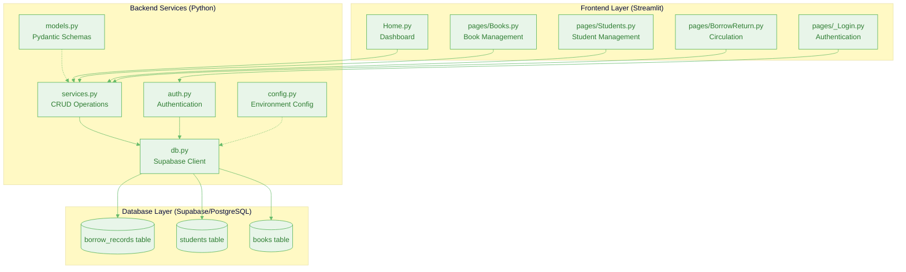
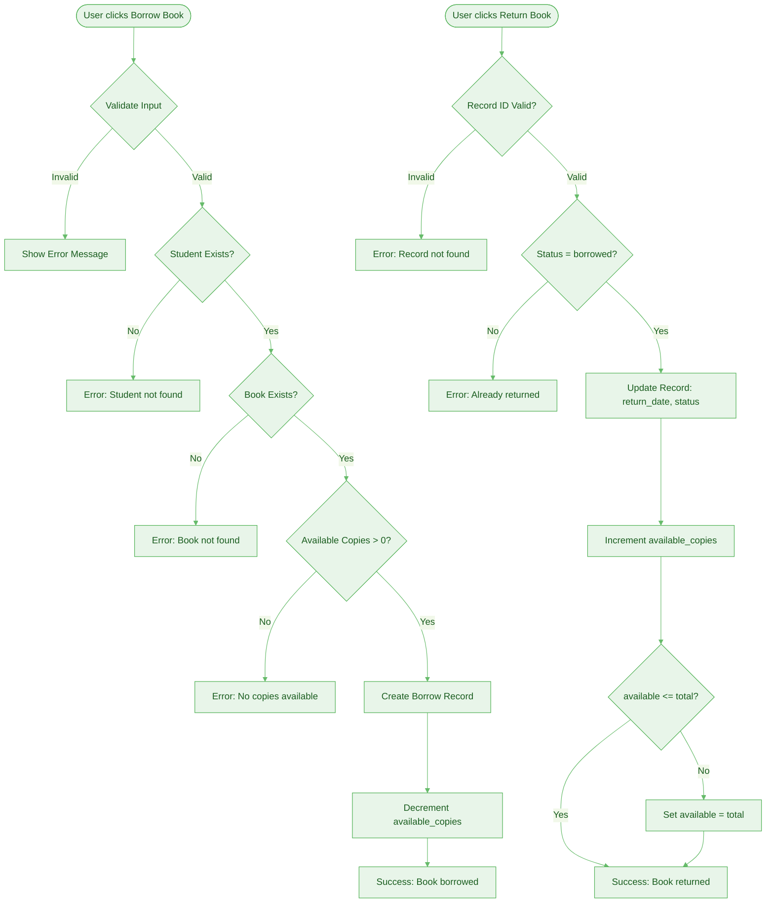
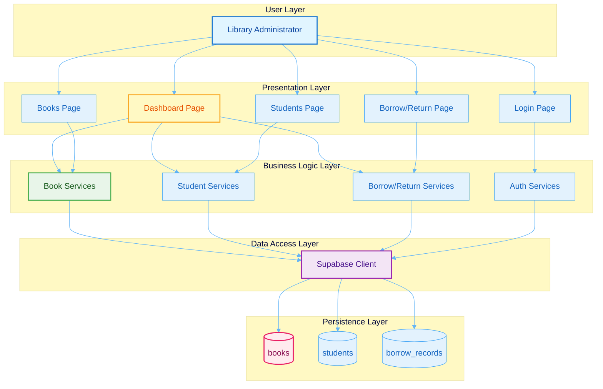
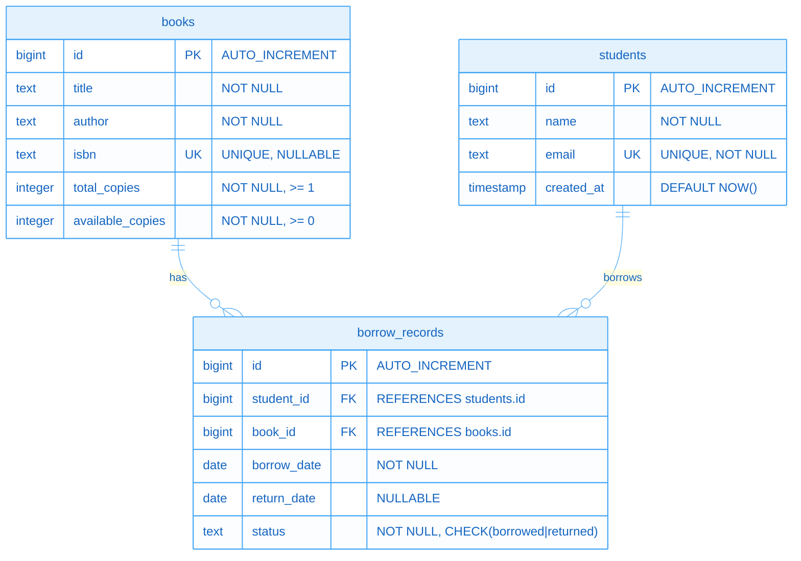
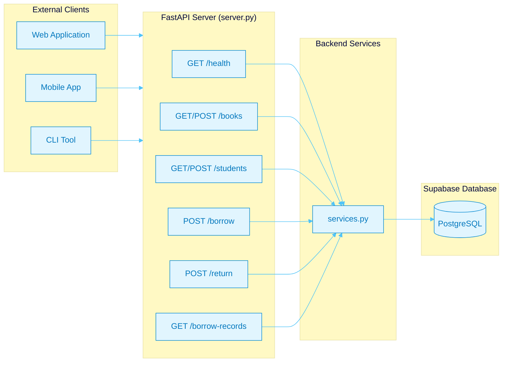
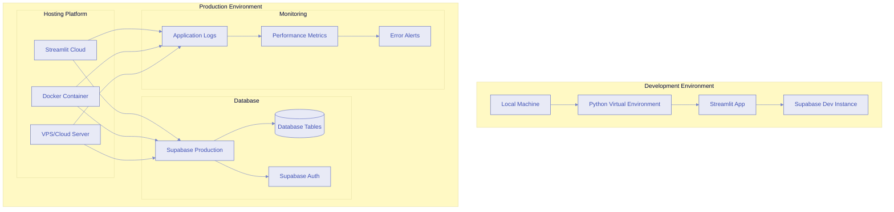

# Software Requirements Specification (SRS)
## Library Management System

**Version:** 1.0.0  
**Date:** November 2025  
**Status:** Production Ready

---

## Table of Contents

1. [Introduction](#1-introduction)
2. [System Overview](#2-system-overview)
3. [Functional Requirements](#3-functional-requirements)
4. [Non-Functional Requirements](#4-non-functional-requirements)
5. [System Architecture](#5-system-architecture)
6. [Database Schema](#6-database-schema)
7. [User Interface Requirements](#7-user-interface-requirements)
8. [API Specifications](#8-api-specifications)
9. [Security Requirements](#9-security-requirements)
10. [Testing Requirements](#10-testing-requirements)
11. [Deployment Requirements](#11-deployment-requirements)
12. [Future Enhancements](#12-future-enhancements)

---

## 1. Introduction

### 1.1 Purpose
This document specifies the requirements for a **Library Management System (LMS)** designed to streamline book inventory management, student registration, and book borrowing/returning operations for educational institutions.

### 1.2 Scope
The system provides:
- **Admin Dashboard** for real-time library analytics
- **Book Management** (CRUD operations)
- **Student Management** (registration and tracking)
- **Borrow/Return Operations** with automatic inventory updates
- **Authentication & Authorization** via Supabase Auth
- **RESTful API** for external integrations

### 1.3 Definitions, Acronyms, and Abbreviations
- **LMS**: Library Management System
- **CRUD**: Create, Read, Update, Delete
- **API**: Application Programming Interface
- **REST**: Representational State Transfer
- **UI**: User Interface
- **SRS**: Software Requirements Specification

### 1.4 References
- Supabase Documentation: https://supabase.com/docs
- Streamlit Documentation: https://docs.streamlit.io
- FastAPI Documentation: https://fastapi.tiangolo.com

---

## 2. System Overview

### 2.1 Product Perspective
The LMS is a web-based application built with:
- **Backend**: Python (FastAPI, Supabase client)
- **Database**: Supabase (PostgreSQL)
- **Frontend**: Streamlit (Python-based web framework)
- **Authentication**: Supabase Auth (GoTrue)

### 2.2 Product Functions
1. **Authentication & Authorization**
   - User registration and login
   - Session management
   - Admin-only access control

2. **Book Management**
   - Add new books with metadata (title, author, ISBN, copies)
   - View complete inventory
   - Track available vs. total copies
   - Automatic stock updates on borrow/return

3. **Student Management**
   - Register new students
   - View student directory
   - Email-based unique identification

4. **Borrow/Return Operations**
   - Issue books to students
   - Return books and update inventory
   - Track active loans
   - Prevent double returns

5. **Analytics Dashboard**
   - Real-time metrics (titles, copies, loans)
   - Visual charts (status distribution, top books)
   - Recent activity logs

### 2.3 User Characteristics
- **Primary Users**: Library Administrators
- **Technical Level**: Basic to intermediate
- **Access**: Admin-only (authentication required)

### 2.4 Constraints
- Requires active Supabase project with configured database
- Internet connection for database operations
- Python 3.8+ runtime environment
- Modern web browser for Streamlit UI

---

## 3. Functional Requirements

### 3.1 Authentication Module

#### FR-1.1: User Registration
- **Description**: New users can create accounts via email/password
- **Input**: Email, password, optional full name
- **Output**: Account created, verification email sent (if configured)
- **Validation**: 
  - Email format validation
  - Password strength requirements (enforced by Supabase)
  - Unique email constraint

#### FR-1.2: User Login
- **Description**: Authenticated users can sign in to access admin dashboard
- **Input**: Email, password
- **Output**: Session token, user metadata stored in session state
- **Validation**: Credentials verified against Supabase Auth

#### FR-1.3: Session Management
- **Description**: Maintain user session across page navigation
- **Behavior**: Session persists until explicit logout or expiration
- **Storage**: Streamlit session state (`st.session_state`)

#### FR-1.4: Logout
- **Description**: Users can sign out, clearing session data
- **Action**: Invalidates Supabase session, clears local state

### 3.2 Book Management Module

#### FR-2.1: Add Book
- **Description**: Admin can add new books to inventory
- **Input**: 
  - Title (required, min 1 character)
  - Author (required, min 1 character)
  - ISBN (optional, unique)
  - Total copies (required, minimum 1)
- **Output**: Book record created with `available_copies = total_copies`
- **Validation**: 
  - Title and author cannot be empty
  - Total copies must be ≥ 1
  - ISBN must be unique if provided

#### FR-2.2: View All Books
- **Description**: Display complete book inventory in tabular format
- **Output**: DataFrame/table with columns: ID, Title, Author, ISBN, Total Copies, Available Copies
- **Sorting**: Default by title (ascending)

#### FR-2.3: Book Inventory Tracking
- **Description**: System automatically tracks available copies
- **Behavior**: 
  - On borrow: `available_copies` decreases by 1
  - On return: `available_copies` increases by 1 (capped at `total_copies`)
- **Constraint**: `available_copies` cannot exceed `total_copies` or go negative

### 3.3 Student Management Module

#### FR-3.1: Register Student
- **Description**: Admin can register new students
- **Input**: 
  - Full Name (required, min 1 character)
  - Email (required, valid email format, unique)
- **Output**: Student record created with timestamp
- **Validation**: 
  - Email must be unique
  - Name cannot be empty

#### FR-3.2: View All Students
- **Description**: Display student directory
- **Output**: DataFrame/table with columns: ID, Name, Email, Created At
- **Sorting**: Default by name (ascending)

### 3.4 Borrow/Return Module

#### FR-4.1: Borrow Book
- **Description**: Issue a book to a student
- **Input**: 
  - Student ID (required, must exist)
  - Book ID (required, must exist)
- **Preconditions**:
  - Student must exist in database
  - Book must exist in database
  - `available_copies > 0`
- **Output**: Borrow record created with status "borrowed", `available_copies` decremented
- **Error Handling**: 
  - Returns error if student/book doesn't exist
  - Returns error if no copies available
  - Prevents negative inventory

#### FR-4.2: Return Book
- **Description**: Process book return and update inventory
- **Input**: Borrow Record ID (required)
- **Preconditions**:
  - Record must exist
  - Record status must be "borrowed" (not already returned)
- **Output**: Record updated with `return_date` and status "returned", `available_copies` incremented
- **Error Handling**:
  - Returns error if record not found
  - Returns error if book already returned
  - Prevents exceeding `total_copies` on increment

#### FR-4.3: View Active Loans
- **Description**: Display all currently borrowed books
- **Output**: DataFrame filtered by `status = "borrowed"`
- **Columns**: Record ID, Student ID, Book ID, Borrow Date, Status

#### FR-4.4: View All Borrow Records
- **Description**: Display complete borrow history
- **Output**: All records with optional status filter
- **Columns**: ID, Student ID, Book ID, Borrow Date, Return Date, Status

### 3.5 Dashboard Module

#### FR-5.1: Key Performance Indicators (KPIs)
- **Description**: Display real-time metrics
- **Metrics**:
  - Total Book Titles
  - Total Copies (sum of all `total_copies`)
  - Available Copies (sum of all `available_copies`)
  - Active Loans (count of records with `status = "borrowed"`)

#### FR-5.2: Inventory Snapshot
- **Description**: Display top 10 books by availability
- **Columns**: Title, Author, Available Copies, Total Copies
- **Sorting**: By `available_copies` (descending)

#### FR-5.3: Borrow Status Distribution
- **Description**: Visual bar chart showing borrowed vs. returned counts
- **Chart Type**: Bar chart
- **Data**: Count of records grouped by status

#### FR-5.4: Top Borrowed Books
- **Description**: Display 5 most frequently borrowed titles
- **Columns**: Title, Borrow Count
- **Calculation**: Count borrow records by `book_id`, join with book titles

#### FR-5.5: Recent Activity
- **Description**: Display last 15 borrow/return transactions
- **Columns**: All borrow record fields
- **Sorting**: By `borrow_date` (descending)

---

## 4. Non-Functional Requirements

### 4.1 Performance
- **Response Time**: Database queries should complete within 2 seconds
- **Concurrent Users**: Support up to 50 simultaneous admin sessions
- **Data Volume**: Handle 10,000+ books, 5,000+ students, 50,000+ borrow records

### 4.2 Reliability
- **Uptime**: 99.5% availability (dependent on Supabase infrastructure)
- **Error Handling**: Graceful error messages for all user-facing operations
- **Data Integrity**: Transactions ensure inventory consistency

### 4.3 Usability
- **Interface**: Clean, bold, table-heavy design
- **Navigation**: Streamlit multipage sidebar for easy access
- **Feedback**: Success/error messages for all actions
- **Accessibility**: Responsive layout, clear labels

### 4.4 Maintainability
- **Code Structure**: Modular backend services, separated concerns
- **Documentation**: Inline comments, type hints, docstrings
- **Version Control**: Git-based versioning

### 4.5 Portability
- **Platform**: Cross-platform (Windows, macOS, Linux)
- **Browser**: Modern browsers (Chrome, Firefox, Edge, Safari)
- **Dependencies**: Managed via `requirements.txt`

### 4.6 Security
- **Authentication**: Supabase Auth with email/password
- **Authorization**: Admin-only access (session-based)
- **Data Protection**: Environment variables for sensitive credentials
- **Input Validation**: Pydantic models for request validation

---

## 5. System Architecture

### 5.1 Architecture Overview
The system follows a **three-tier architecture**:



### 5.2 Technology Stack

#### Frontend
- **Framework**: Streamlit 1.28+
- **Visualization**: Streamlit native charts, Pandas DataFrames
- **Styling**: Custom CSS (bold, simple colors)

#### Backend
- **Language**: Python 3.8+
- **Database Client**: Supabase Python SDK
- **API Framework**: FastAPI (optional REST API)
- **Validation**: Pydantic
- **Environment**: python-dotenv

#### Database
- **Provider**: Supabase (PostgreSQL)
- **Authentication**: Supabase Auth (GoTrue)

### 5.3 Component Interaction


#### 5.3.1 Borrow/Return Workflow



#### 5.3.2 Complete System Data Flow



---

## 6. Database Schema

### 6.1 Entity Relationship Diagram



### 6.2 Table Specifications

#### 6.2.1 `books`
| Column | Type | Constraints | Description |
|--------|------|-------------|-------------|
| `id` | `bigint` | PRIMARY KEY, AUTO_INCREMENT | Unique book identifier |
| `title` | `text` | NOT NULL | Book title |
| `author` | `text` | NOT NULL | Author name |
| `isbn` | `text` | UNIQUE, NULLABLE | International Standard Book Number |
| `total_copies` | `integer` | NOT NULL, ≥ 1 | Total number of copies owned |
| `available_copies` | `integer` | NOT NULL, ≥ 0 | Currently available copies |

**Business Rules**:
- `available_copies ≤ total_copies`
- `available_copies ≥ 0`
- `total_copies ≥ 1`

#### 6.2.2 `students`
| Column | Type | Constraints | Description |
|--------|------|-------------|-------------|
| `id` | `bigint` | PRIMARY KEY, AUTO_INCREMENT | Unique student identifier |
| `name` | `text` | NOT NULL | Full name |
| `email` | `text` | UNIQUE, NOT NULL | Email address |
| `created_at` | `timestamp` | DEFAULT NOW() | Registration timestamp |

**Business Rules**:
- Email must be unique
- Email format validated by application

#### 6.2.3 `borrow_records`
| Column | Type | Constraints | Description |
|--------|------|-------------|-------------|
| `id` | `bigint` | PRIMARY KEY, AUTO_INCREMENT | Unique record identifier |
| `student_id` | `bigint` | FOREIGN KEY → `students.id` | Student who borrowed |
| `book_id` | `bigint` | FOREIGN KEY → `books.id` | Book borrowed |
| `borrow_date` | `date` | NOT NULL | Date book was issued |
| `return_date` | `date` | NULLABLE | Date book was returned |
| `status` | `text` | NOT NULL, CHECK | Status: "borrowed" or "returned" |

**Business Rules**:
- `status` must be either "borrowed" or "returned"
- `return_date` is NULL when `status = "borrowed"`
- `return_date` is set when `status = "returned"`
- Foreign keys ensure referential integrity

### 6.3 Indexes
- `books.isbn` (unique index)
- `students.email` (unique index)
- `borrow_records.student_id` (index for joins)
- `borrow_records.book_id` (index for joins)
- `borrow_records.status` (index for filtering)

---

## 7. User Interface Requirements

### 7.1 Design Principles
- **Bold Text**: All headings and labels use bold font
- **Simple Colors**: Neutral palette (grays, blues)
- **Table-Heavy**: Data displayed primarily in tabular format
- **Responsive**: Layout adapts to screen size

### 7.2 Page Specifications

#### 7.2.1 Login Page (`pages/_Login.py`)
- **Purpose**: User authentication
- **Components**:
  - Title: "🔐 Admin Login"
  - Two tabs: "Sign In" and "Register"
  - Form fields: Email, Password (with confirmation for registration)
  - Submit buttons
  - Sign-out button (if already logged in)
- **Validation**: Real-time error messages

#### 7.2.2 Dashboard (`Home.py`)
- **Purpose**: Overview and analytics
- **Components**:
  - Four KPI cards (Titles, Total Copies, Available Copies, Active Loans)
  - Two-column layout:
    - Left: Inventory Snapshot (top 10 books)
    - Right: Borrow Status Split (bar chart)
  - Two-column layout:
    - Left: (removed - monthly trend)
    - Right: Top Borrowed Books (table)
  - Full-width: Recent Activity (last 15 records)
- **Styling**: Custom CSS for metric cards

#### 7.2.3 Books Page (`pages/Books.py`)
- **Purpose**: Book inventory management
- **Components**:
  - Form: Add New Book (Title, Author, ISBN, Total Copies)
  - Submit button
  - Divider
  - Full-width table: All books with all columns
- **Actions**: Add book, view inventory

#### 7.2.4 Students Page (`pages/Students.py`)
- **Purpose**: Student registration and directory
- **Components**:
  - Form: Register Student (Full Name, Email)
  - Submit button
  - Divider
  - Full-width table: All students
- **Actions**: Add student, view directory

#### 7.2.5 Borrow/Return Page (`pages/BorrowReturn.py`)
- **Purpose**: Circulation operations
- **Components**:
  - Two-column layout:
    - Left: Borrow Book form (Student ID, Book ID, Issue button)
    - Right: Return Book form (Record ID, Return button)
  - Divider
  - Full-width table: Active Loans
- **Actions**: Borrow book, return book, view active loans

### 7.3 Navigation
- **Sidebar**: Streamlit auto-generated multipage navigation
- **Page Order**: Home, Login, Books, Students, BorrowReturn
- **Access Control**: All pages except Login require authentication

---

## 8. API Specifications

### 8.1 REST API Endpoints (FastAPI)

The system includes an optional REST API server (`server.py`) for external integrations.

#### 8.1.0 API Architecture Diagram



#### 8.1.1 Health Check
- **Endpoint**: `GET /health`
- **Response**: `{"status": "ok"}`
- **Purpose**: Service availability check

#### 8.1.2 Books
- **List Books**: `GET /books`
  - Returns: Array of book objects
- **Create Book**: `POST /books`
  - Body: `{title, author, isbn?, total_copies}`
  - Returns: Created book object
  - Status: 201 Created

#### 8.1.3 Students
- **List Students**: `GET /students`
  - Returns: Array of student objects
- **Create Student**: `POST /students`
  - Body: `{name, email}`
  - Returns: Created student object
  - Status: 201 Created

#### 8.1.4 Borrow/Return
- **Borrow Book**: `POST /borrow`
  - Body: `{student_id, book_id}`
  - Returns: `{success: true, message: "..."}` or error
  - Status: 201 Created or 400 Bad Request
- **Return Book**: `POST /return`
  - Body: `{record_id}`
  - Returns: `{success: true, message: "..."}` or error
  - Status: 200 OK or 400 Bad Request

#### 8.1.5 Borrow Records
- **List Records**: `GET /borrow-records?status=borrowed`
  - Query param: `status` (optional, filters by status)
  - Returns: Array of borrow record objects

### 8.2 Error Responses
All endpoints return standard error format:
```json
{
  "detail": "Error message description"
}
```
Status codes: 400 (Bad Request), 404 (Not Found), 500 (Internal Server Error)

### 8.3 CORS
- **Configuration**: All origins allowed (`*`)
- **Methods**: All methods allowed
- **Headers**: All headers allowed

---

## 9. Security Requirements

### 9.1 Authentication
- **Method**: Supabase Auth (email/password)
- **Session**: Stored in Streamlit session state
- **Token**: Access token and refresh token managed by Supabase

### 9.2 Authorization
- **Access Control**: Admin-only (all pages except Login)
- **Enforcement**: `require_admin()` function checks `st.session_state["supabase_user"]`
- **API**: Currently no API-level auth (can be added with JWT middleware)

### 9.3 Data Protection
- **Credentials**: Stored in `.env` file (not committed to version control)
- **Environment Variables**:
  - `SUPABASE_URL`: Supabase project URL
  - `SUPABASE_KEY`: Supabase service role or anon key
  - `ADMIN_PASSCODE`: (Optional, for fallback auth)

### 9.4 Input Validation
- **Frontend**: Streamlit form validation
- **Backend**: Pydantic models for type checking and constraints
- **Database**: Foreign key constraints, unique constraints, check constraints

### 9.5 Error Handling
- **User-Facing**: Friendly error messages (no stack traces)
- **Logging**: Errors logged to console (can be extended to file/cloud logging)

---

## 10. Testing Requirements

### 10.1 Unit Testing
- **Scope**: Backend service functions
- **Coverage**: 
  - Book CRUD operations
  - Student CRUD operations
  - Borrow/return logic
  - Validation rules
- **Framework**: pytest (recommended)

### 10.2 Integration Testing
- **Scope**: Frontend-backend-database interactions
- **Scenarios**:
  - Complete borrow/return workflow
  - Inventory updates
  - Error handling paths

### 10.3 User Acceptance Testing (UAT)
- **Scenarios**:
  1. Admin logs in successfully
  2. Admin adds a new book
  3. Admin registers a student
  4. Admin borrows a book (inventory decreases)
  5. Admin returns a book (inventory increases)
  6. Dashboard displays correct metrics
  7. Error handling for invalid inputs

### 10.4 Performance Testing
- **Load**: Test with 100+ concurrent requests
- **Data Volume**: Test with 10,000+ records
- **Response Time**: Ensure < 2 seconds for all operations

---

## 11. Deployment Requirements

### 11.0 Deployment Architecture



### 11.1 Prerequisites
- Python 3.8 or higher
- Active Supabase project with:
  - Database tables created
  - Auth enabled
  - Service role key configured
- Internet connection

### 11.2 Installation Steps

1. **Clone/Download Project**
   ```bash
   cd library-management-system
   ```

2. **Create Virtual Environment**
   ```bash
   python -m venv .venv
   .venv\Scripts\activate  # Windows
   # or
   source .venv/bin/activate  # Linux/Mac
   ```

3. **Install Dependencies**
   ```bash
   pip install -r requirements.txt
   ```

4. **Configure Environment**
   - Create `.env` file in project root
   - Add:
     ```
     SUPABASE_URL=https://xxxx.supabase.co
     SUPABASE_KEY=your-service-role-or-anon-key
     ```

5. **Set Up Database**
   - Run SQL scripts in Supabase SQL Editor to create tables
   - (Optional) Insert sample data

6. **Run Application**
   ```bash
   streamlit run frontend/Home.py
   ```

### 11.3 Production Deployment
- **Streamlit Cloud**: Deploy via Streamlit Community Cloud
- **Docker**: Containerize application (Dockerfile recommended)
- **Environment Variables**: Set via hosting platform secrets
- **Database**: Use Supabase production instance

### 11.4 Monitoring
- **Logs**: Streamlit logs, Supabase logs
- **Metrics**: Track API response times, error rates
- **Alerts**: Set up alerts for critical errors

---

## 12. Future Enhancements

### 12.1 Planned Features
1. **Email Notifications**
   - Overdue book reminders
   - Return date notifications

2. **Advanced Search**
   - Full-text search for books
   - Filter by author, genre, availability

3. **Reports**
   - Export to CSV/PDF
   - Monthly/yearly statistics

4. **QR Code Integration**
   - Generate QR codes for books
   - Scan to borrow/return

5. **Fine Management**
   - Calculate overdue fines
   - Payment tracking

6. **Multi-Library Support**
   - Support multiple library branches
   - Cross-branch book transfers

7. **Mobile App**
   - Native mobile application
   - Offline capability

### 12.2 Technical Improvements
- **Caching**: Implement Redis for frequently accessed data
- **API Authentication**: Add JWT-based API auth
- **Rate Limiting**: Prevent abuse of API endpoints
- **Database Migrations**: Use Alembic or similar for schema versioning
- **CI/CD**: Automated testing and deployment pipelines

---

## Appendix A: Sample Data

See the provided SQL scripts for:
- 20 sample students
- 30 sample books
- 60 sample borrow records (20 returned)

## Appendix B: Project Structure

```
library-management-system/
├── backend/
│   ├── __init__.py
│   ├── auth.py          # Authentication helpers
│   ├── config.py        # Environment configuration
│   ├── db.py            # Supabase client
│   ├── models.py        # Pydantic models
│   └── services.py      # Business logic
├── frontend/
│   ├── Home.py          # Dashboard
│   └── pages/
│       ├── _Login.py    # Authentication
│       ├── Books.py     # Book management
│       ├── Students.py  # Student management
│       └── BorrowReturn.py  # Circulation
├── server.py            # FastAPI REST API (optional)
├── requirements.txt     # Python dependencies
├── .env                 # Environment variables (not in repo)
└── README.md            # Project documentation
```

## Appendix C: Dependencies

```
streamlit
supabase
gotrue
python-dotenv
pydantic
requests
fastapi
uvicorn
pandas
```

---

**Document End**

For questions or updates, contact the development team.

